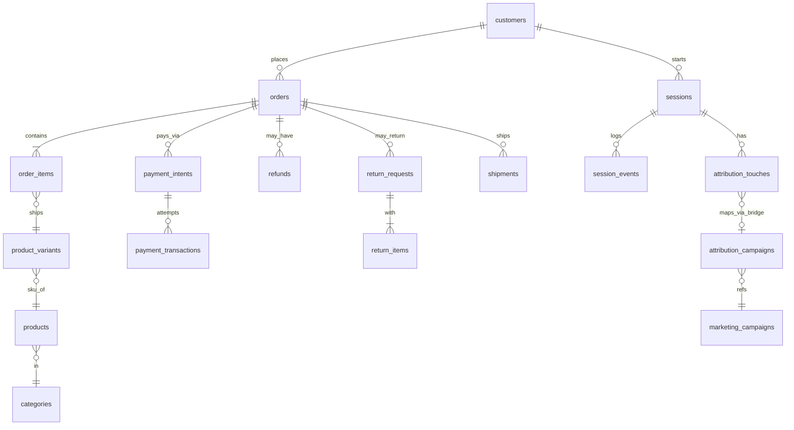

# saas_schema.md

## Section A — Table Inventory
(Grain, approx row count, purpose for each table) [Inventory](https://github.com/dikshaadsul27-wq/sql-product-analytics/blob/501170d117a298af1cad3c8f9372bb5689905ec4/notes/Inventory.md)

## Section B — Column Dictionary

Row counts:[Row counts](https://github.com/dikshaadsul27-wq/sql-product-analytics/blob/501170d117a298af1cad3c8f9372bb5689905ec4/notes/Row%20counts.md)

## Section C — ER Diagram (Mermaid)

## Section D — Column dictionary for key tables

## Section E — Data quality and quirks section

## Section F — Six probe questions answered explicitly

## Section G — Sample queries section with the three queries and short interpretations

