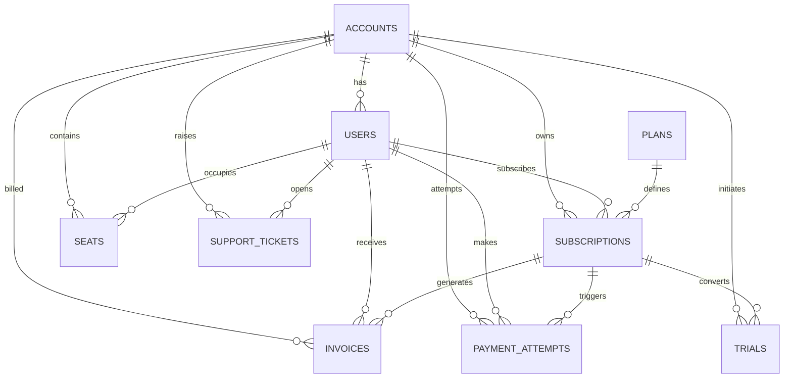

# saas_schema.md

## Section A — Table Inventory
(Grain, approx row count, purpose for each table) [Inventory](https://github.com/dikshaadsul27-wq/sql-product-analytics/blob/501170d117a298af1cad3c8f9372bb5689905ec4/notes/Inventory.md)

### 1. accounts
- Grain: a single account
- Approx row count: 1,250
- Purpose: a company can have multiple accounts

### 2. email_sends
- Grain: an email sent out to a user
- Approx row count: 3,385
- Purpose:

### 3. events
- Grain: an event by a user
- Approx row count: 53,534
- Purpose:

### 4. experiment_assignments
- Grain: user invovled in the experiment
- Approx row count: 3,200
- Purpose:

### 5. experiment_variants
- Grain: variant of an experiment
- Approx row count: 8
- Purpose:

### 6. experiments
- Grain: an experiment conducted
- Approx row count: 4
- Purpose:

### 7. features
- Grain: a feature and its details
- Approx row count: 50
- Purpose:

### 8. invoices
- Grain: an invoice for a user
- Approx row count: 4,201
- Purpose:

### 9. legacy_companies
- Grain: a company and its details
- Approx row count: 200
- Purpose:

### 10. legacy_events
- Grain: an event recorded against a company
- Approx row count: 15,028
- Purpose:

### 11. legacy_invoices
- Grain: an invoice for a company (instead of a single user)
- Approx row count: 1,500
- Purpose:

### 12. legacy_subscriptions
- Grain: a subscription by a company (instead of a single user)
- Approx row count: 500
- Purpose:

### 13. legacy_support_tickets
- Grain: a ticked opened against a company (instead of a single user)
- Approx row count: 300
- Purpose:

### 14. payment_attempts
- Grain: a payment attempt made (including failed attempts)
- Approx row count: 5,690
- Purpose:

### 15. plans
- Grain: a plan with price and seat limit
- Approx row count: 8
- Purpose:

### 16. seats
- Grain: a user within an account with activated and/or deactivated date
- Approx row count: 1,556
- Purpose:

### 17. subscription_events
- Grain: a event that records change in subscription (start,changed,converted,cancelled,etc)
- Approx row count: 3,741
- Purpose:

### 18. subscriptions
- Grain: a subscription by user/account and subscription details
- Approx row count: 2,113
- Purpose:

### 19. support_tickets
- Grain: a ticket opened by users
- Approx row count: 1,249
- Purpose:

### 20. trials
- Grain: 
- Approx row count: 250
- Purpose:

### 21. users
- Grain: a user and their info
- Approx row count: 2,556
- Purpose:

## Section B — Column Dictionary

Row counts: [Row counts](https://github.com/dikshaadsul27-wq/sql-product-analytics/blob/501170d117a298af1cad3c8f9372bb5689905ec4/notes/Row%20counts.md)

## Section C — ER Diagram (Mermaid)

## Section D — Column dictionary for key tables

## Section E — Data quality and quirks section

## Section F — Six probe questions answered explicitly

### 1. What is the grain of `subscriptions`?

Self‑serve accounts → user‑grain
- Each row represents one user’s subscription period.
- user_id is populated, seat_count = 1.
- If a user churns and later resubscribes, you’ll see two rows (one per subscription period).
- a single user could have multiple plans.

B2B accounts → account‑grain
- Each row represents one account’s subscription period.
- user_id is NULL, seat_count can be dozens.
- If the account churns and resubscribes, you’ll see the same row with updated status.

### 2. How is MRR stored / how do I compute it?

MRR is derived from plan price × seat count, adjusted for billing interval:

MRR=monthly_price×seat_count

Self‑serve accounts:
- seat_count = 1
- user_id is set
- MRR = plan’s monthly price

B2B accounts:
- seat_count can be dozens
- user_id is NULL
- MRR = plan’s monthly price × seat_count

### 3. What `status` values exist with counts?

### 4. How do I distinguish trial from paid?

Combined together subscriptions, trials and plans table.The subscriptions.mrr field alone is not enough because free plans can show mrr = 0 even when status = 'active'.
To distinguish apply below filters:
Trial if:
- s.status = 'trialing', OR
- p.monthly_price = 0, OR
- t.converted_at IS NULL and trial period not ended.

Paid if:
- s.status = 'active' or past_due, AND
- mrr > 0, AND
- p.monthly_price > 0.

### 5. What timezone are timestamps in?

Both subscriptions.start_date and subscription_events.event_time are stored as timestamp without time zone, conventionally in UTC. They are not IST unless you explicitly convert them

### 6. Is there a soft-delete pattern?

None of the tables have a deleted_at column. That means there is no need to add deleted_at IS NULL filters in queries.
But need to filter by status to avoid double‑counting churned, paused, or free subscriptions when calculating metrics like MRR or active users.

## Section G — Sample queries section with the three queries and short interpretations

