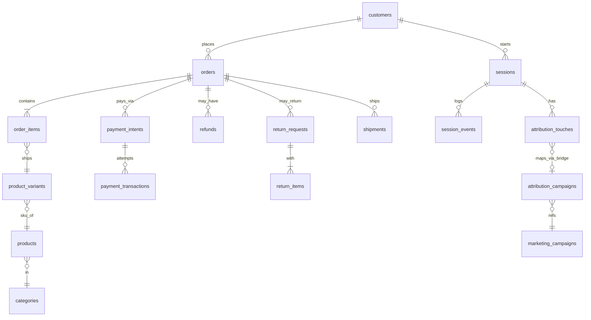

# saas_schema.md

## Section A — Table Inventory
(Grain, approx row count, purpose for each table) [Inventory](https://github.com/dikshaadsul27-wq/sql-product-analytics/blob/501170d117a298af1cad3c8f9372bb5689905ec4/notes/Inventory.md)

### 1. accounts
- Grain: 
- Approx row count: 1,250
- Purpose:

### 2. email_sends
- Grain: 
- Approx row count: 3,385
- Purpose:

### 3. events
- Grain: 
- Approx row count: 53,534
- Purpose:

### 4. experiment_assignments
- Grain: 
- Approx row count: 3,200
- Purpose:

### 5. experiment_variants
- Grain: 
- Approx row count: 8
- Purpose:

### 6. experiments
- Grain: 
- Approx row count: 4
- Purpose:

### 7. features
- Grain: 
- Approx row count: 50
- Purpose:

### 8. invoices
- Grain: 
- Approx row count: 4,201
- Purpose:

### 9. legacy_companies
- Grain: 
- Approx row count: 200
- Purpose:

### 10. legacy_events
- Grain: 
- Approx row count: 15,028
- Purpose:

### 11. legacy_invoices
- Grain: 
- Approx row count: 1,500
- Purpose:

### 12. legacy_subscriptions
- Grain: 
- Approx row count: 500
- Purpose:

### 13. legacy_support_tickets
- Grain: 
- Approx row count: 300
- Purpose:

### 14. payment_attempts
- Grain: 
- Approx row count: 5,690
- Purpose:

### 15. plans
- Grain: 
- Approx row count: 8
- Purpose:

### 16. seats
- Grain: 
- Approx row count: 1,556
- Purpose:

### 17. subscription_events
- Grain: 
- Approx row count: 3,741
- Purpose:

### 18. subscriptions
- Grain: 
- Approx row count: 2,113
- Purpose:

### 19. support_tickets
- Grain: 
- Approx row count: 1,249
- Purpose:

### 20. trials
- Grain: 
- Approx row count: 250
- Purpose:

### 21. users
- Grain: 
- Approx row count: 2,556
- Purpose:

## Section B — Column Dictionary

Row counts: [Row counts](https://github.com/dikshaadsul27-wq/sql-product-analytics/blob/501170d117a298af1cad3c8f9372bb5689905ec4/notes/Row%20counts.md)

## Section C — ER Diagram (Mermaid)

## Section D — Column dictionary for key tables

## Section E — Data quality and quirks section

## Section F — Six probe questions answered explicitly

## Section G — Sample queries section with the three queries and short interpretations

