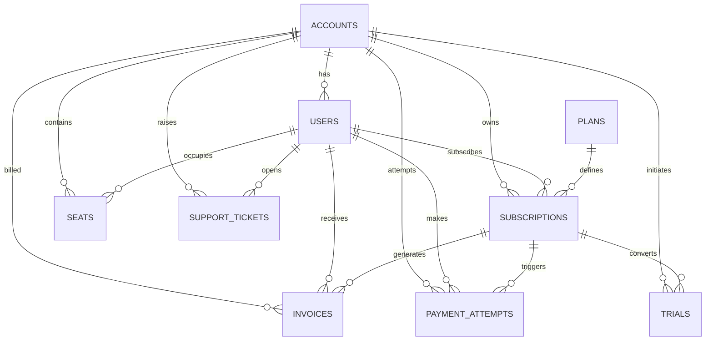

# saas_schema.md

## Section A — Table Inventory
(Grain, approx row count, purpose for each table) [Inventory](https://github.com/dikshaadsul27-wq/sql-product-analytics/blob/501170d117a298af1cad3c8f9372bb5689905ec4/notes/Inventory.md)

### 1. accounts
- Grain: a single account
- Approx row count: 1,250
- Purpose: Master record of customer accounts. A company can have multiple accounts

### 2. email_sends
- Grain: an email sent out to a user
- Approx row count: 3,385
- Purpose: Tracks marketing and transactional emails sent to users, useful for engagement and campaign analysis.

### 3. events
- Grain: an event by a user
- Approx row count: 53,534
- Purpose: Logs product usage events (feature clicks, actions).

### 4. experiment_assignments
- Grain: user invovled in the experiment
- Approx row count: 3,200
- Purpose: Records which users were assigned to which experiments, enabling A/B test analysis.

### 5. experiment_variants
- Grain: variant of an experiment
- Approx row count: 8
- Purpose: Defines the possible variants for experiments.

### 6. experiments
- Grain: an experiment conducted
- Approx row count: 4
- Purpose: Metadata for experiments (name, start/end dates, description).

### 7. features
- Grain: a feature and its details
- Approx row count: 50
- Purpose: Catalog of product features, used to join with events for feature adoption analysis.

### 8. invoices
- Grain: an invoice for a user
- Approx row count: 4,201
- Purpose: Billing records tied to subscriptions, used for revenue recognition and payment reconciliation.

### 9. legacy_companies
- Grain: a company and its details
- Approx row count: 200
- Purpose: Historical company records from the legacy system, kept for migration and backfill.

### 10. legacy_events
- Grain: an event recorded against a company
- Approx row count: 15,028
- Purpose: Historical usage events tied to companies in the legacy system.

### 11. legacy_invoices
- Grain: an invoice for a company (instead of a single user)
- Approx row count: 1,500
- Purpose:  Historical invoices from the legacy system, account‑level billing.

### 12. legacy_subscriptions
- Grain: a subscription by a company (instead of a single user)
- Approx row count: 500
- Purpose: Historical subscription records from the legacy system.

### 13. legacy_support_tickets
- Grain: a ticked opened against a company (instead of a single user)
- Approx row count: 300
- Purpose: Historical support tickets from the legacy system.

### 14. payment_attempts
- Grain: a payment attempt made (including failed attempts)
- Approx row count: 5,690
- Purpose: Tracks successful and failed payment attempts, critical for dunning and churn prevention.

### 15. plans
- Grain: a plan with price and seat limit
- Approx row count: 8
- Purpose: Defines subscription plans (starter, pro, enterprise), with pricing and seat rules.

### 16. seats
- Grain: a user within an account with activated and/or deactivated date
- Approx row count: 1,556
- Purpose: Tracks seat assignments in B2B accounts, used to measure active seat usage.

### 17. subscription_events
- Grain: a event that records change in subscription (start,changed,converted,cancelled,etc)
- Approx row count: 3,741
- Purpose: Lifecycle log of subscription changes, used for churn, upgrades, downgrades analysis.

### 18. subscriptions
- Grain: a subscription by user/account and subscription details
- Approx row count: 2,113
- Purpose: Core subscription records (status, plan, MRR), basis for revenue and churn metrics.

### 19. support_tickets
- Grain: a ticket opened by users
- Approx row count: 1,249
- Purpose: Tracks customer support interactions at the user level.

### 20. trials
- Grain: a trial period for a user/account
- Approx row count: 250
- Purpose: Records free trial activations, used to measure conversion to paid subscriptions.

### 21. users
- Grain: a user and their info
- Approx row count: 2,556
- Purpose: Master record of individual users, linked to accounts, subscriptions, events, and experiments.

## Section B — Column Dictionary

Row counts: [Row counts](https://github.com/dikshaadsul27-wq/sql-product-analytics/blob/501170d117a298af1cad3c8f9372bb5689905ec4/notes/Row%20counts.md)

## Section C — ER Diagram (Mermaid)

## Section D — Column dictionary for key tables

## Section E — Data quality and quirks section

### 1. Plan name case drift

In subscriptions.plan, values appear in inconsistent casing: "pro", "Pro", "professional", "Enterprise", "enterprise".
This creates duplicate categories when grouping by plan.
Fix: Normalize plan names to lowercase or join on plans.plan_id instead of free‑text.

### 2. NULL cancellation_reason on churned subscriptions (~31%)

Many rows with status = 'churned' have cancellation_reason IS NULL.
This limits churn analysis (can’t distinguish “too_expensive” vs “switched_competitor”).
Fix: Enforce reason capture at cancellation or backfill with “unspecified.”

### 3. NULL plan_id on subscriptions (~9%)

About 9% of subscriptions rows have plan_id IS NULL.
This breaks joins to plans and makes MRR validation unreliable.
Fix: Audit ETL pipeline to ensure every subscription maps to a valid plan_id.

### 4.Orphan user_id rows in events (~40)

In events, ~40 rows reference user_id values that don’t exist in users.
These are orphaned events, likely due to deleted or failed signups.
Fix: Add foreign key enforcement or clean up orphan rows.

### 5.Future‑dated subscription_events (~234 rows)

In subscription_events.event_time, ~234 rows have timestamps later than “today.”
These are invalid for cohort analysis and retention math.
Fix: Filter out future‑dated events or correct ETL timestamp logic.

## Section F — Six probe questions answered explicitly

### 1. What is the grain of `subscriptions`?

Self‑serve accounts → user‑grain
- Each row represents one user’s subscription period.
- user_id is populated, seat_count = 1.
- If a user churns and later resubscribes, you’ll see two rows (one per subscription period).
- a single user could have multiple plans.

B2B accounts → account‑grain
- Each row represents one account’s subscription period.
- user_id is NULL, seat_count can be dozens.
- If the account churns and resubscribes, you’ll see the same row with updated status.

### 2. How is MRR stored / how do I compute it?

MRR is derived from plan price × seat count, adjusted for billing interval:

MRR=monthly_price×seat_count

Self‑serve accounts:
- seat_count = 1
- user_id is set
- MRR = plan’s monthly price

B2B accounts:
- seat_count can be dozens
- user_id is NULL
- MRR = plan’s monthly price × seat_count

### 3. What `status` values exist with counts?

### 4. How do I distinguish trial from paid?

Combined together subscriptions, trials and plans table.The subscriptions.mrr field alone is not enough because free plans can show mrr = 0 even when status = 'active'.
To distinguish apply below filters:
Trial if:
- s.status = 'trialing', OR
- p.monthly_price = 0, OR
- t.converted_at IS NULL and trial period not ended.

Paid if:
- s.status = 'active' or past_due, AND
- mrr > 0, AND
- p.monthly_price > 0.

### 5. What timezone are timestamps in?

Both subscriptions.start_date and subscription_events.event_time are stored as timestamp without time zone, conventionally in UTC. They are not IST unless you explicitly convert them

### 6. Is there a soft-delete pattern?

None of the tables have a deleted_at column. That means there is no need to add deleted_at IS NULL filters in queries.
But need to filter by status to avoid double‑counting churned, paused, or free subscriptions when calculating metrics like MRR or active users.

## Section G — Sample queries section with the three queries and short interpretations

### 1. "How many active paying accounts are there right now?" (remember to normalize `LOWER(plan)`)

### 2. "What's the breakdown of accounts by plan?" (collapse case drift)

Query: SELECT LOWER(p.plan_name) AS plan
       COUNT(DISTINCT a.account_id) AS account_count
FROM saas.subscriptions s
JOIN saas.accounts a ON s.account_id = a.account_id
JOIN saas.plans p ON s.plan_id = p.plan_id
WHERE s.status = 'active'
  AND s.mrr > 0
GROUP BY LOWER(p.plan_name)
ORDER BY account_count DESC;

Output: 

### 3. "Show 10 sample subscription_events in chronological order."

Query: SELECT se.event_id,
       se.subscription_id,
       se.account_id,
       se.event_type,
       se.event_time AS event_time_utc,
       se.event_time AT TIME ZONE 'UTC' AT TIME ZONE 'Asia/Kolkata' AS event_time_ist
FROM saas.subscription_events se
ORDER BY se.event_time ASC
LIMIT 10;

Output: 

